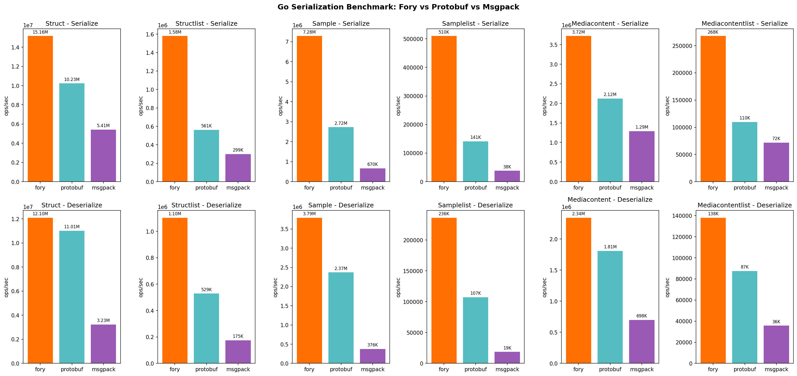

# Go Serialization Benchmark

This directory contains benchmarks comparing [Apache Fory](https://github.com/apache/fory) with Protocol Buffers and MessagePack for Go serialization.

## Serializers Compared

- **Fory**: Apache Fory Go implementation - high-performance cross-language serialization
- **Protocol Buffers**: Google's protobuf via `google.golang.org/protobuf`
- **MessagePack**: Efficient binary serialization via `github.com/vmihailenco/msgpack/v5`

## Data Types Benchmarked

| Data Type        | Description                                      |
| ---------------- | ------------------------------------------------ |
| NumericStruct    | Simple struct with 8 int32 fields                |
| Sample           | Complex struct with primitives and 7 array types |
| MediaContent     | Nested objects with strings, enums, and lists    |
| StructList       | List of NumericStruct (20 elements)              |
| SampleList       | List of Sample (20 elements)                     |
| MediaContentList | List of MediaContent (20 elements)               |

The benchmark data matches the C++ benchmark for cross-language comparison.

## Quick Start

### Prerequisites

- Go 1.21+
- Protocol Buffers compiler (`protoc`)

Install protoc:

```bash
# macOS
brew install protobuf

# Ubuntu/Debian
apt-get install protobuf-compiler

# Or download from https://github.com/protocolbuffers/protobuf/releases
```

### Run Benchmarks

```bash
# Run all benchmarks
./run.sh

# Run specific data type
./run.sh --data struct
./run.sh --data sample
./run.sh --data mediacontent
./run.sh --data structlist
./run.sh --data samplelist
./run.sh --data mediacontentlist

# Run specific serializer
./run.sh --serializer fory
./run.sh --serializer protobuf
./run.sh --serializer msgpack

# Combine filters
./run.sh --data struct --serializer fory

# Customize benchmark parameters
./run.sh --count 10 --benchtime 2s

# Skip report generation
./run.sh --no-report
```

### Manual Run

```bash
# Generate protobuf code
mkdir -p proto
protoc --proto_path=../proto \
    --go_out=proto \
    --go_opt=paths=source_relative \
    ../proto/bench.proto

# Download dependencies
go mod tidy

# Run benchmarks
go test -bench=. -benchmem

# Run specific benchmark
go test -bench=BenchmarkFory_Struct -benchmem
```

## Results

Example results on Apple M1 Pro:

<p align="center">

</p>

| Data Type        | Operation   | Fory (ops/s) | Protobuf (ops/s) | Msgpack (ops/s) | Fory vs PB | Fory vs MP |
| ---------------- | ----------- | ------------ | ---------------- | --------------- | ---------- | ---------- |
| Struct           | Serialize   | 15.16M       | 10.23M           | 5.41M           | 1.48x      | 2.80x      |
| Struct           | Deserialize | 12.10M       | 11.01M           | 3.23M           | 1.10x      | 3.75x      |
| Structlist       | Serialize   | 1.58M        | 561K             | 299K            | 2.82x      | 5.28x      |
| Structlist       | Deserialize | 1.10M        | 529K             | 175K            | 2.09x      | 6.30x      |
| Sample           | Serialize   | 7.28M        | 2.72M            | 670K            | 2.68x      | 10.87x     |
| Sample           | Deserialize | 3.79M        | 2.37M            | 376K            | 1.60x      | 10.09x     |
| Samplelist       | Serialize   | 510K         | 141K             | 38K             | 3.61x      | 13.34x     |
| Samplelist       | Deserialize | 236K         | 107K             | 19K             | 2.20x      | 12.66x     |
| Mediacontent     | Serialize   | 3.72M        | 2.12M            | 1.29M           | 1.75x      | 2.88x      |
| Mediacontent     | Deserialize | 2.34M        | 1.81M            | 698K            | 1.30x      | 3.35x      |
| Mediacontentlist | Serialize   | 268K         | 110K             | 72K             | 2.44x      | 3.72x      |
| Mediacontentlist | Deserialize | 138K         | 87K              | 36K             | 1.58x      | 3.86x      |

_Note: Results vary by hardware. Run benchmarks on your own system for accurate comparisons. List benchmarks are included in the generated report._

## Serialized Data Sizes (bytes)

| Data Type        | Fory | Protobuf | Msgpack |
| ---------------- | ---- | -------- | ------- |
| Struct           | 58   | 61       | 57      |
| Sample           | 446  | 375      | 524     |
| MediaContent     | 342  | 301      | 400     |
| StructList       | 560  | 1260     | 1146    |
| SampleList       | 7600 | 7560     | 10486   |
| MediaContentList | 5776 | 6080     | 8006    |

## Benchmark Methodology

### Fair Comparison

The benchmarks follow the same methodology as the C++ benchmark:

1. **Conversion Cost Included**: For protobuf, the benchmark includes converting plain Go structs to/from protobuf messages, matching real-world usage patterns.

2. **Buffer Reuse**: Each serializer uses its optimal pattern for buffer management.

3. **Same Test Data**: Test data matches the C++ benchmark exactly for cross-language comparisons.

### What's Measured

- **Serialize**: Time to convert a Go struct to bytes
- **Deserialize**: Time to convert bytes back to a Go struct
- **Memory**: Allocations per operation (with `-benchmem`)

## Output Files

After running `./run.sh`:

- `benchmark_results.txt` - Human-readable benchmark output
- `benchmark_results.json` - JSON format for programmatic analysis
- `benchmark_report.md` - Generated markdown report
- `benchmark_*.png` - Performance comparison charts (requires matplotlib)

## Directory Structure

```
go/
├── README.md              # This file
├── go.mod                 # Go module definition
├── models.go              # Data structures (NumericStruct, Sample, MediaContent)
├── proto_convert.go       # Protobuf conversion utilities
├── benchmark_test.go      # Benchmark tests
├── run.sh                 # Build and run script
├── benchmark_report.py    # Report generation script
└── proto/                 # Generated protobuf code (after running)
    └── bench.pb.go
```

## Contributing

When adding new benchmarks:

1. Add data structures to `models.go`
2. Add protobuf conversions to `proto_convert.go`
3. Add benchmark functions to `benchmark_test.go`
4. Update this README with new data types

## License

Licensed under the Apache License, Version 2.0.
