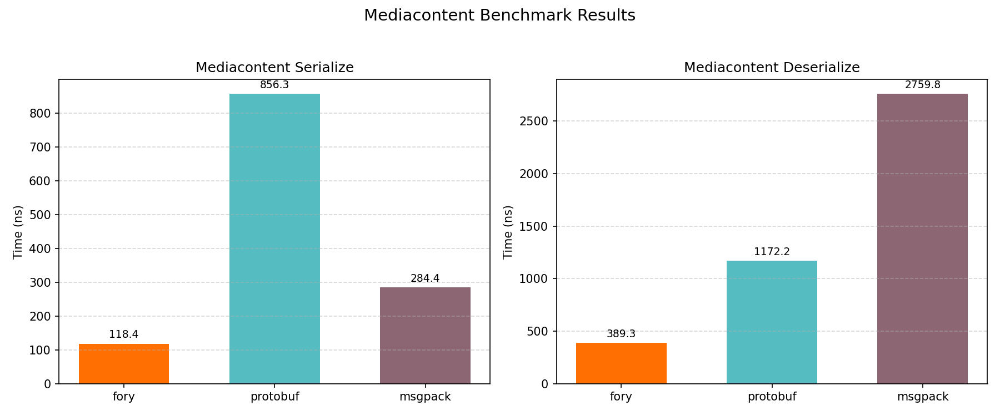
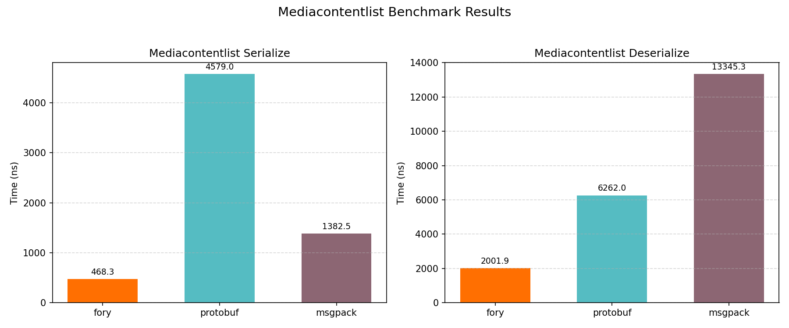
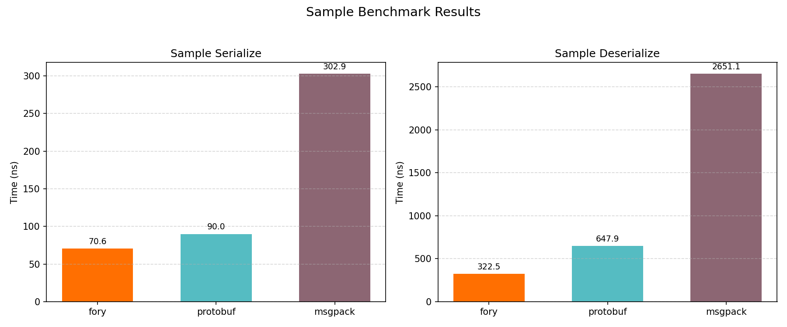
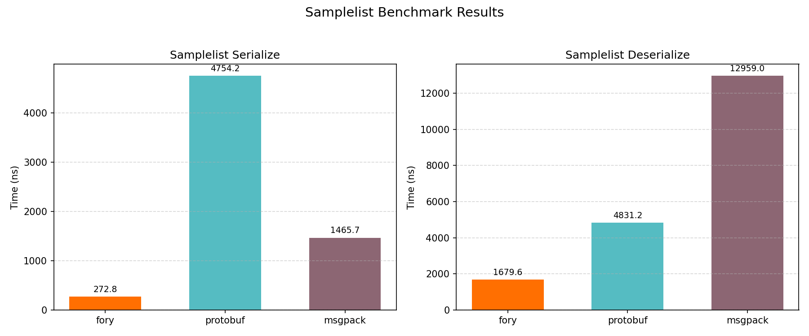
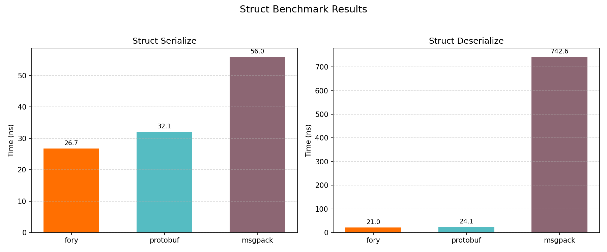
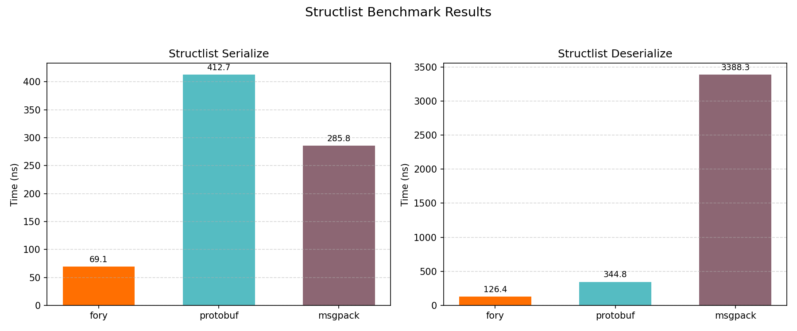
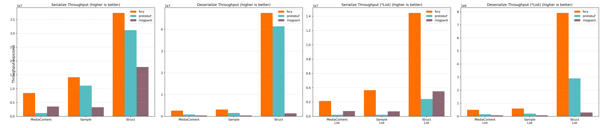

# C++ Benchmark Performance Report

_Generated on 2026-02-19 10:07:57_

## How to Generate This Report

```bash
cd benchmarks/cpp_benchmark/build
./fory_benchmark --benchmark_format=json --benchmark_out=benchmark_results.json
cd ..
python benchmark_report.py --json-file build/benchmark_results.json --output-dir report
```

## Hardware & OS Info

| Key | Value |
|-----|-------|
| OS | Darwin 24.6.0 |
| Machine | arm64 |
| Processor | arm |
| CPU Cores (Physical) | 12 |
| CPU Cores (Logical) | 12 |
| Total RAM (GB) | 48.0 |
| Benchmark Date | 2026-02-19T10:07:21+08:00 |
| CPU Cores (from benchmark) | 12 |

## Benchmark Plots

### Mediacontent

<p align="center">

</p>

### Mediacontentlist

<p align="center">

</p>

### Sample

<p align="center">

</p>

### Samplelist

<p align="center">

</p>

### Struct

<p align="center">

</p>

### Structlist

<p align="center">

</p>

### Throughput

<p align="center">

</p>

## Benchmark Results

### Timing Results (nanoseconds)

| Datatype | Operation | fory (ns) | protobuf (ns) | msgpack (ns) | Fastest |
|----------|-----------|-----------|---------------|--------------|---------|
| MediaContent | Serialize | 118.4 | 856.3 | 284.4 | fory |
| MediaContent | Deserialize | 389.3 | 1172.2 | 2759.8 | fory |
| MediaContentList | Serialize | 468.3 | 4579.0 | 1382.5 | fory |
| MediaContentList | Deserialize | 2001.9 | 6262.0 | 13345.3 | fory |
| Sample | Serialize | 70.6 | 90.0 | 302.9 | fory |
| Sample | Deserialize | 322.5 | 647.9 | 2651.1 | fory |
| SampleList | Serialize | 272.8 | 4754.2 | 1465.7 | fory |
| SampleList | Deserialize | 1679.6 | 4831.2 | 12959.0 | fory |
| Struct | Serialize | 26.7 | 32.1 | 56.0 | fory |
| Struct | Deserialize | 21.0 | 24.1 | 742.6 | fory |
| StructList | Serialize | 69.1 | 412.7 | 285.8 | fory |
| StructList | Deserialize | 126.4 | 344.8 | 3388.3 | fory |

### Throughput Results (ops/sec)

| Datatype | Operation | fory TPS | protobuf TPS | msgpack TPS | Fastest |
|----------|-----------|----------|--------------|-------------|---------|
| MediaContent | Serialize | 8,448,220 | 1,167,763 | 3,516,463 | fory |
| MediaContent | Deserialize | 2,569,039 | 853,100 | 362,346 | fory |
| MediaContentList | Serialize | 2,135,221 | 218,387 | 723,326 | fory |
| MediaContentList | Deserialize | 499,536 | 159,693 | 74,932 | fory |
| Sample | Serialize | 14,171,197 | 11,109,574 | 3,301,701 | fory |
| Sample | Deserialize | 3,101,117 | 1,543,406 | 377,200 | fory |
| SampleList | Serialize | 3,665,359 | 210,339 | 682,267 | fory |
| SampleList | Deserialize | 595,373 | 206,990 | 77,166 | fory |
| Struct | Serialize | 37,444,357 | 31,187,829 | 17,868,627 | fory |
| Struct | Deserialize | 47,602,758 | 41,423,123 | 1,346,630 | fory |
| StructList | Serialize | 14,470,682 | 2,422,814 | 3,499,255 | fory |
| StructList | Deserialize | 7,913,226 | 2,900,435 | 295,133 | fory |

### Serialized Data Sizes (bytes)

| Datatype | fory | protobuf | msgpack |
|----------|------|----------|---------|
| Struct | 58 | 61 | 55 |
| Sample | 446 | 375 | 530 |
| MediaContent | 365 | 301 | 480 |
| StructList | 184 | 315 | 289 |
| SampleList | 1980 | 1890 | 2664 |
| MediaContentList | 1535 | 1520 | 2421 |
