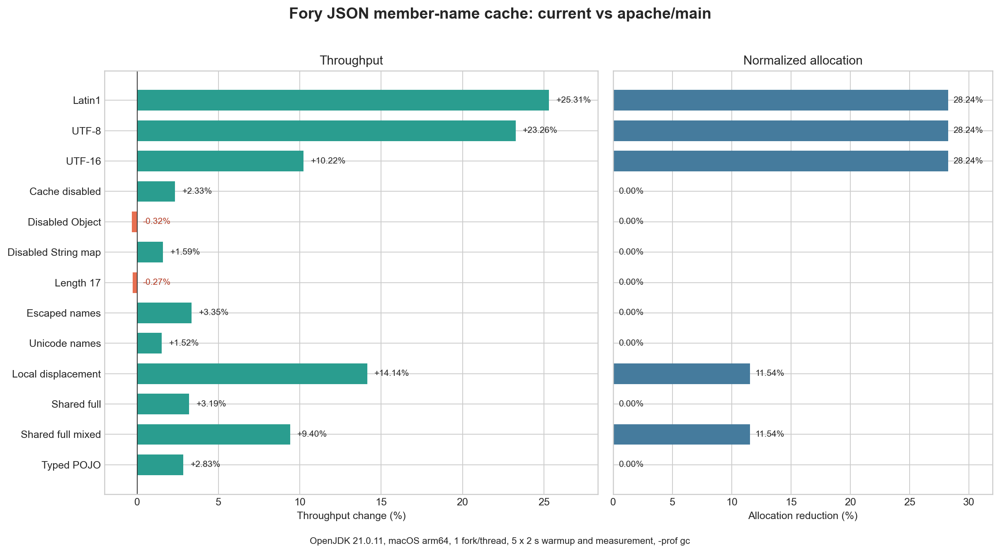

# JSON Member-Name Cache Benchmark

This report compares JSON parsing before and after the bounded member-name cache. It covers the
three input representations, cache-disabled and ineligible controls, escaped and Unicode names,
local-slot displacement, a full shared cache, and a typed object whose known fields do not retain
parsed keys.

## Environment

- Baseline: `bb0cbd1c0dcfad6e8ab0afd84e0ebbb16d9c1b9b`
- Current: `8b13e87c990364546331750ac10972f9144617b0` plus the benchmark-only steady-state collision
  correction in this report
- Operating system: macOS 15.7.2, arm64
- Processor: Apple M4 Pro
- Memory: 48 GiB
- Java: OpenJDK 21.0.11, 64-bit Server VM
- JMH: 1.37
- Heap: `-Xms2g -Xmx2g`
- Execution: one fork, one thread, five 2-second warmup iterations, five 2-second measurement
  iterations, throughput mode, `gc` profiler

Each case was run as an adjacent pair: the baseline shaded JAR was built from the baseline worktree
and measured immediately before installing, building, and measuring the current worktree. Because
the benchmark class is new, the exact current source was copied into the baseline worktree and the
checked-in compatibility patch changed only setup-time access to the new builder method. The
payload constants and benchmark methods therefore stayed identical. `javap` verified that the
baseline JAR did not contain `withMaxCachedMemberNames`, the current JAR did, and both JARs contained
the same benchmark payload for the measured case.

## Command

Create the baseline worktree, copy the exact benchmark source, and apply the setup-only compatibility
patch:

```bash
git fetch apache main
git worktree add --detach ../fory-benchmark-baseline \
  bb0cbd1c0dcfad6e8ab0afd84e0ebbb16d9c1b9b

cp benchmarks/java/src/main/java/org/apache/fory/benchmark/JsonObjectParseBenchmark.java \
  ../fory-benchmark-baseline/benchmarks/java/src/main/java/org/apache/fory/benchmark/

git -C ../fory-benchmark-baseline apply --unidiff-zero \
  "$(pwd)/docs/benchmarks/java/data/json-member-name-cache-baseline.patch"
```

The patch uses reflection only inside JMH `@Setup`. On the baseline, absence of
`withMaxCachedMemberNames` already means caching is disabled. No reflection, feature detection, or
compatibility branch runs inside a benchmark method. The current worktree uses the source directly
without this patch.

Install the Java artifacts and build the benchmark JAR in each worktree before running its half of
the pair:

```bash
cd java
JAVA_HOME="$JDK21_HOME" PATH="$JDK21_HOME/bin:$PATH" \
  mvn -T16 -B --no-transfer-progress clean install \
  -DskipTests -Dmaven.javadoc.skip=true

cd ../benchmarks/java
JAVA_HOME="$JDK21_HOME" PATH="$JDK21_HOME/bin:$PATH" \
  mvn -B --no-transfer-progress clean package -Pjmh -DskipTests

"$JDK21_HOME/bin/java" -jar target/benchmarks.jar \
  'org.apache.fory.benchmark.JsonObjectParseBenchmark.<case>$' \
  -f 1 -wi 5 -i 5 -w 2s -r 2s -t 1 -prof gc \
  -jvmArgsAppend '-Xms2g -Xmx2g' -rf json -rff <result.json>
```

`parseLocalCollision` parses `{"first":1,"second":2}` with a one-slot reader-local table. Both
names are already in the shared cache, so every invocation forces two local displacements and two
shared canonical-entry recoveries instead of becoming a warmed local hit.

## Results

Higher throughput is better. Allocation change is normalized bytes per operation; negative values
mean less allocation. The escaped-name row is the median of two isolated adjacent pairs because its
individual forks showed higher variance. Every other row is one final adjacent pair.



| Benchmark                     | Baseline ops/ms | Current ops/ms | Throughput | Baseline B/op | Current B/op | Allocation |
| ----------------------------- | --------------: | -------------: | ---------: | ------------: | -----------: | ---------: |
| `parseLatin1`                 |        4110.838 |       5151.234 |    +25.31% |      1360.001 |      976.001 |    -28.24% |
| `parseUtf8`                   |        4385.356 |       5405.371 |    +23.26% |      1360.001 |      976.001 |    -28.24% |
| `parseUtf16`                  |        4020.632 |       4431.555 |    +10.22% |      1360.001 |      976.001 |    -28.24% |
| `parseCacheDisabled`          |        4021.526 |       4115.200 |     +2.33% |      1360.001 |     1360.001 |      0.00% |
| `parseCacheDisabledObject`    |        4482.781 |       4468.580 |     -0.32% |      1360.001 |     1360.001 |      0.00% |
| `parseCacheDisabledStringMap` |        5548.215 |       5636.258 |     +1.59% |       976.001 |      976.001 |      0.00% |
| `parseLength17`               |        3259.125 |       3250.231 |     -0.27% |      1488.001 |     1488.001 |      0.00% |
| `parseEscapedNames`           |        3026.698 |       3128.064 |     +3.35% |      1360.001 |     1360.001 |      0.00% |
| `parseUnicodeNames`           |        4509.465 |       4578.033 |     +1.52% |      1360.001 |     1360.001 |      0.00% |
| `parseLocalCollision`         |       12660.073 |      14450.239 |    +14.14% |       416.000 |      368.000 |    -11.54% |
| `parseSharedFull`             |       27892.269 |      28781.574 |     +3.19% |       248.000 |      248.000 |      0.00% |
| `parseSharedFullMixed`        |       12624.544 |      13811.082 |     +9.40% |       416.000 |      368.000 |    -11.54% |
| `parseTypedPojo`              |       49073.098 |      50463.150 |     +2.83% |        48.000 |       48.000 |      0.00% |

The common retained-key cases improve throughput by 10.22% to 25.31% and reduce allocation by
28.24%. The steady-state local-displacement case improves throughput by 14.14% and removes 48 bytes
per parse. Disabled, ineligible, escaped, Unicode, full-cache, and typed controls are faster or
within 1% of baseline, with no allocation increase.

The source data for the table and plot is
[`data/json-member-name-cache.csv`](data/json-member-name-cache.csv).
The exact baseline setup delta is
[`data/json-member-name-cache-baseline.patch`](data/json-member-name-cache-baseline.patch).
